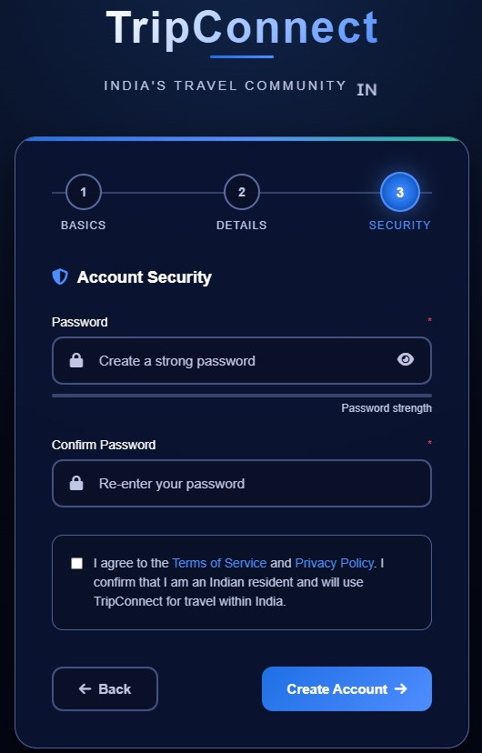
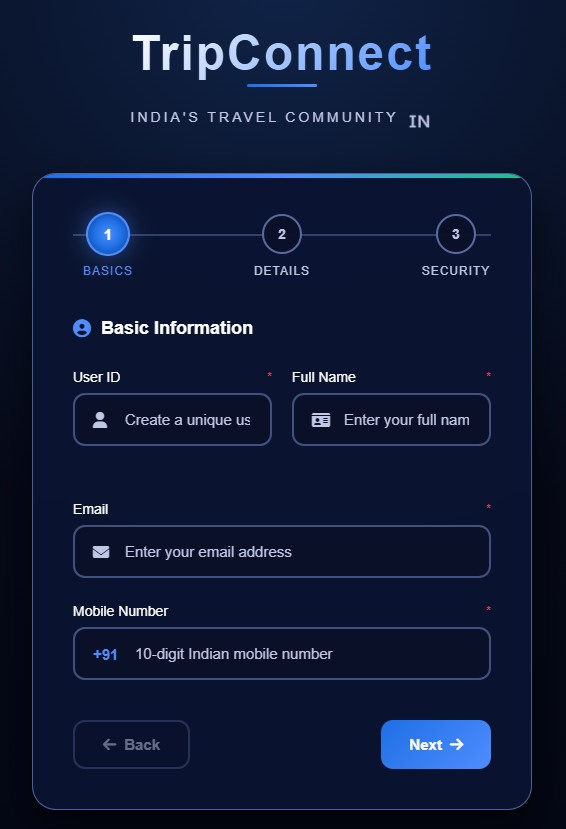
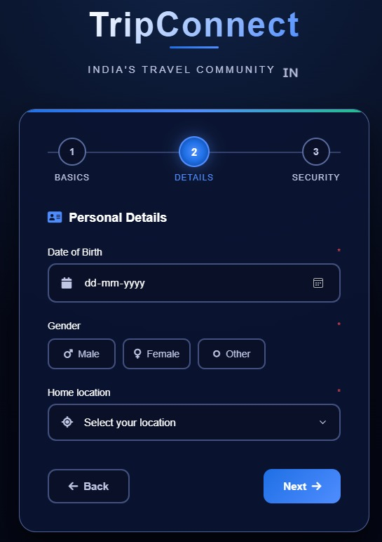
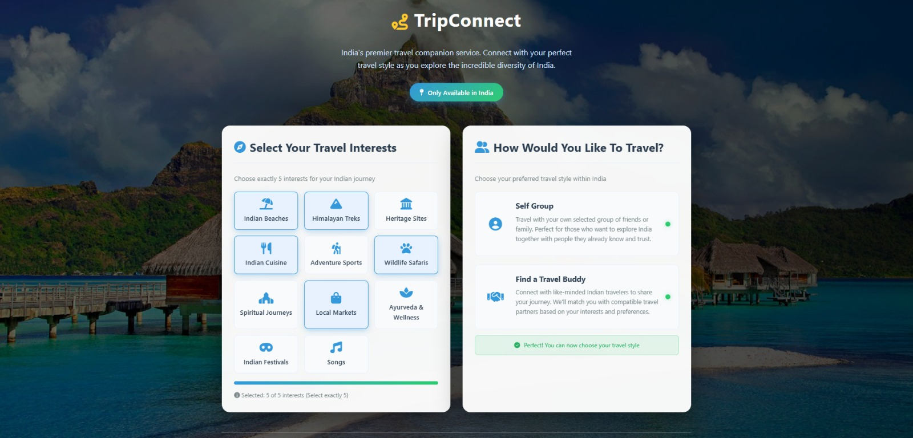
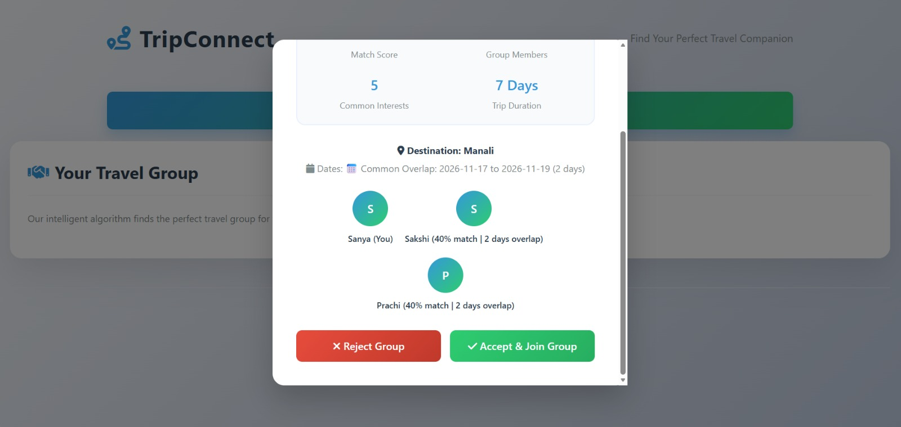
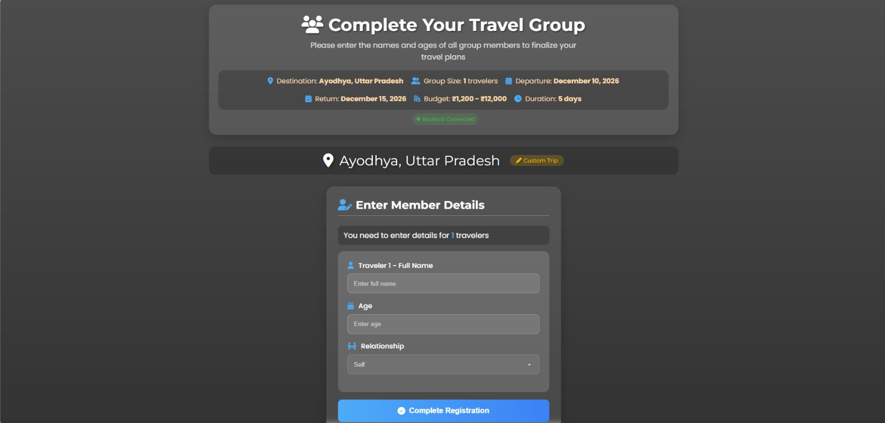
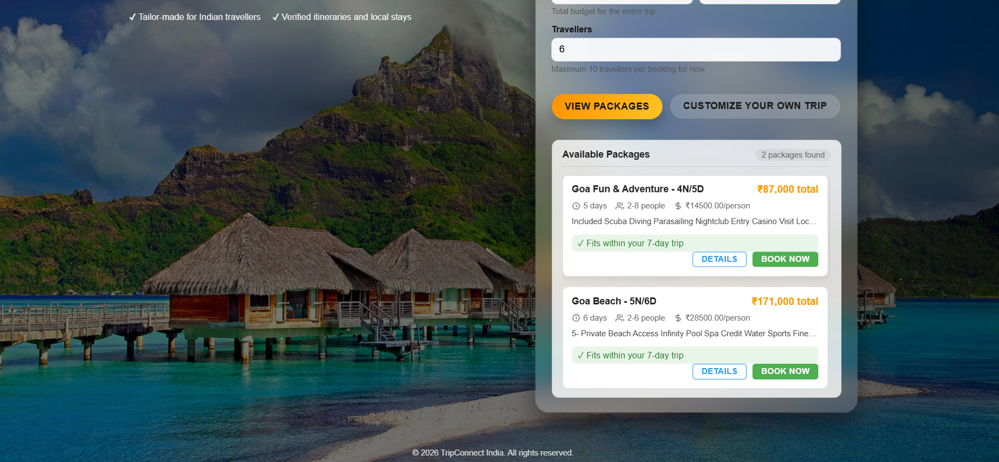
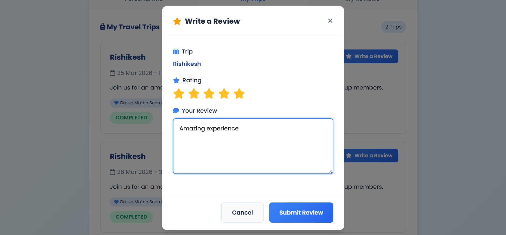

# TripConnect

TripConnect is a full-stack travel companion platform that helps solo travelers connect with compatible travel partners, create customized trips, join travel groups, and explore curated travel packages.

The platform intelligently matches travelers based on destination, travel dates, budget range, group size, and common interests, making group travel easier, safer, and more enjoyable.

---

## Live Project

GitHub Repository:

https://github.com/Nishtha30mar/TripConnect-Find-Your-Travel-Companion.git

---

## Project Overview

Planning trips alone can be expensive and challenging. TripConnect solves this problem by allowing users to:

- Find compatible travel buddies
- Join existing travel groups
- Create customized trips
- Explore travel packages
- Generate travel itineraries
- Manage travel preferences
- Connect with travelers having similar interests

The platform provides both package-based travel and fully customizable travel planning options.

---

## Key Features

### User Authentication

- User Registration
- Secure Login System
- JWT Authentication
- Password Encryption
- Protected Routes
- User Profile Management

---

### Travel Preference Management

Users can save:

- Preferred Destination
- Travel Date Range
- Budget Range
- Group Size
- Travel Interests
- Travel Style

Preferences are stored and used for traveler matching.

---

### Travel Buddy Mode

Users looking for companions can:

- Find matching travelers
- Join travel groups
- Connect with users having similar interests
- Travel together while sharing costs and experiences

---

### Self Group Mode

Users can:

- Create their own travel group
- Invite travelers
- Manage group members
- Customize group travel plans

---

### Custom Trip Creation

Users can create a personalized trip by entering:

- Destination
- Travel Dates
- Budget
- Group Size

After entering trip details, users can choose:

#### Package-Based Travel

Browse and select from available travel packages.

#### Fully Customized Travel

Create their own travel experience and itinerary.

The system generates a trip request which can be matched with compatible travelers.

---

### Travel Matching System

TripConnect matches users based on:

- Destination
- Date Range
- Budget Compatibility
- Group Size
- Common Interests

This helps users discover suitable travel companions automatically.

---

### Package Discovery

Users can:

- Browse destinations
- Search travel packages
- Compare available options
- Select preferred travel plans

---

### Itinerary Planning

Users can have customized travel itineraries to organize:

- Destinations
- Activities
- Travel Schedule
- Budget Planning

---

### Reviews & Feedback

Travelers can:

- Leave trip reviews
- Share experiences
- Rate trips and groups

---

## Technology Stack

### Frontend

- HTML5
- CSS3
- JavaScript

### Backend

- Node.js
- Express.js

### Database

- MySQL

### Authentication

- JWT (JSON Web Tokens)
- bcryptjs

### Additional Libraries

- mysql2
- cors
- dotenv
- nodemon

---

## Database Design

### Tables

#### users

Stores user account information.

#### travel_preferences

Stores traveler preferences such as:

- destination
- budget
- travel dates
- interests

#### travel_groups

Stores created travel groups.

#### travel_group_members

Stores group membership information.

#### group_members

Handles user-group relationships.

#### packages

Stores available travel packages.

#### trip_reviews

Stores traveler reviews and ratings.

---

## Project Structure

```text
TRIPCONNECT
│
├── frontend
│
├── mysql
│
├── routes
│   ├── authRoutes.js
│   ├── groupRoutes.js
│   ├── memberRoutes.js
│   ├── packageRoutes.js
│   ├── preferenceRoutes.js
│   └── reviewRoutes.js
│
├── README.md
│
└── Database Scripts
```

---

## API Modules

### Authentication

```http
POST /api/auth/signup
POST /api/auth/login
GET  /api/auth/profile
```

### Preferences

```http
POST /api/preferences/save
GET  /api/preferences
```

### Packages

```http
GET /api/packages/search
GET /api/packages/destinations
```

### Groups

```http
POST /api/groups/create
GET  /api/groups
```

### Reviews

```http
POST /api/reviews
GET  /api/reviews
```

---

## Installation

### Clone Repository

```bash
git clone https://github.com/Nishtha30mar/TripConnect-Find-Your-Travel-Companion.git
cd TripConnect
```

### Install Dependencies

```bash
npm install
```

### Configure Environment Variables

Create a `.env` file:

```env
DB_HOST=localhost
DB_USER=root
DB_PASSWORD=your_password
DB_NAME=tripconnect_db

JWT_SECRET=your_secret_key
PORT=5000
```

### Run Server

```bash
npm start
```

or

```bash
nodemon server.js
```

---

## Screenshots

### User Registration

 
 

### Travel Preferences



### Travel Buddy Mode



### Self Group Mode



### Package Selection


### User Reviews


---

## Future Enhancements

- Real-Time Chat Between Travelers
- AI-Based Traveler Recommendations
- Google Maps Integration
- Hotel Booking Integration
- Flight Booking Integration
- Push Notifications
- Mobile Application
- Payment Gateway Integration
- Group Expense Tracking

---

## Learning Outcomes

Through this project I gained experience in:

- REST API Development
- JWT Authentication
- MySQL Database Design
- Backend Development using Express.js
- Full-Stack Application Architecture
- User Authentication & Authorization
- Relational Database Management
- Travel Recommendation Logic
- API Integration
- Frontend-Backend Communication

---

## Resume Highlights

- Developed a full-stack travel companion platform using Node.js, Express.js, MySQL, HTML, CSS, and JavaScript.
- Implemented JWT-based authentication and secure password encryption using bcrypt.
- Designed a traveler matching system based on destination, travel dates, budget, group size, and common interests.
- Developed custom trip creation, travel buddy matching, itinerary planning, and package discovery modules.
- Designed and managed a relational MySQL database with multiple interconnected entities for users, groups, packages, reviews, and travel preferences.

---

## Author

Nishtha Garg

B.Tech Computer Science Engineering  
Banasthali Vidyapith

GitHub:
https://github.com/Nishtha30mar

LinkedIn:
https://www.linkedin.com/in/nishtha-garg-631875353/